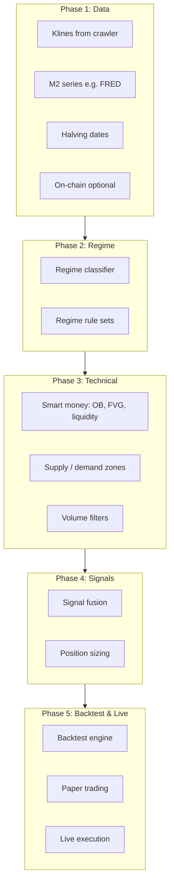

# Trading Strategy Implementation Plan

Phased implementation: data → regime → technical (smart money, supply/demand, volume) → signal fusion → backtest → execution.

## Overview



---

## Phase 1: Data (foundation)

| Task | Description | Status / notes |
|------|-------------|----------------|
| 1.1 | Klines | Use crawler output (spot/futures, 1h/1d from 2017). Merge CSVs per symbol/interval. | Done |
| 1.2 | M2 series | Add US (or global) M2 YoY: FRED API or CSV. Align by date for regime. | To do |
| 1.3 | Halving / seasonal | Use `strategy.timeline`: halving dates, seasonal month flag. | Done |
| 1.4 | On-chain (optional) | SOPR, MVRV, exchange flows: Glassnode (or CSV). Align by date. | To do |

**Deliverables:** Loaders that return aligned DataFrames/series for klines, M2, halving phase, seasonal, and optional on-chain.

**Data understanding:** See [DATA_UNDERSTANDING.md](DATA_UNDERSTANDING.md) for kline schema, layout, and mapping to strategy. **Strategy plan after data:** See [STRATEGY_PLAN_AFTER_DATA.md](STRATEGY_PLAN_AFTER_DATA.md) for next steps (loader → regime on history → backtest). Kline loader: `data_loaders.load_klines(data_dir, market_type, symbol, interval)` returns `KlineSeries` (OHLCV + open_time).

---

## Phase 2: Regime

| Task | Description | Status / notes |
|------|-------------|----------------|
| 2.1 | Regime classifier | Price-based (MA trend + volatility). Already in `strategy.regime`. | Done |
| 2.2 | M2/on-chain in classifier | Pass M2 YoY, SOPR, MVRV into `RegimeInputs` when available. | To do |
| 2.3 | Regime rule sets | Entry/exit/sizing per regime in `strategy.rules`. | Done |
| 2.4 | Regime on history | Label each bar (or rolling window) as bear/bull/sideways for backtest. | To do |

**Deliverables:** Single function: (klines + optional M2/on-chain) → regime label per bar; rule set per regime.

---

## Phase 3: Technical (smart money, supply/demand, volume)

| Task | Description | Status / notes |
|------|-------------|----------------|
| 3.1 | Order blocks (OB) | Detect last opposite candle before strong move; store high/low as zone. | In progress |
| 3.2 | Fair value gaps (FVG) | 3-candle imbalance: bullish FVG (gap up), bearish FVG (gap down). | In progress |
| 3.3 | Liquidity levels | Swing highs/lows; detect sweeps (wick beyond level then close back). | In progress |
| 3.4 | Supply / demand zones | Consolidation then expansion; zone = range of last candle before break. | In progress |
| 3.5 | Volume | Volume SMA, volume climax, volume confirmation (e.g. breakout with above-avg volume). | In progress |
| 3.6 | Structure | Break of structure (BOS) / change of character (CHoCH) from swing points. | To do |

**Deliverables:** Functions that take OHLCV (+ optional lookback) and return: list of active OBs, FVGs, liquidity levels, supply/demand zones, and volume state (e.g. high/neutral/low, confirmation flag).

---

## Phase 4: Signal fusion and position sizing

| Task | Description | Status / notes |
|------|-------------|----------------|
| 4.1 | Entry conditions | Combine: regime allows direction + price at OB/FVG/zone + volume confirmation (optional). | To do |
| 4.2 | Exit conditions | Stop from regime rules + liquidity/OB invalidation; target from next zone or R-multiple. | To do |
| 4.3 | Position size | Base size × regime rule `position_size_pct` × optional volatility (ATR) scaling. | To do |
| 4.4 | Filters | Halving phase, seasonal, on-chain extremes as filters (e.g. no new longs if MVRV > 3.5). | To do |

**Deliverables:** Single entry/exit/sizing pipeline: (regime, technical zones, volume, timeline filters) → signal (long/short/none), stop, target, size.

---

## Phase 5: Backtest and execution

| Task | Description | Status / notes |
|------|-------------|----------------|
| 5.1 | Backtest engine | Walk forward on klines; compute regime, technical levels, signals; simulate PnL with regime rules. | To do |
| 5.2 | Metrics | Sharpe, max DD, win rate, profit factor, per-regime stats. | To do |
| 5.3 | Paper trading | Same logic, live or delayed data; log orders and fills. | To do |
| 5.4 | Live execution | Connect to exchange (e.g. Binance); risk limits; same regime + technical + sizing. | To do |

**Deliverables:** Backtest script, report; paper runner; live runner (optional, with clear risk disclaimer).

---

## Dependencies

- **Phase 2** depends on Phase 1 (at least klines; M2/on-chain optional).
- **Phase 3** depends only on OHLCV (can use Phase 1 klines).
- **Phase 4** depends on Phase 2 and Phase 3.
- **Phase 5** depends on Phase 4.

Recommended order: complete Phase 1 (add M2 loader), Phase 2 (wire M2 into regime), Phase 3 (technical module), Phase 4 (fusion), then Phase 5.

---

## File layout (target)

```
Trading-bot/
├── data/                    # Crawler output (ZIPs, merged CSVs)
├── crawler/                 # Binance klines crawler
├── strategy/
│   ├── regime.py            # Regime classifier + rule sets
│   ├── rules.py
│   ├── timeline.py          # Halving, seasonal
│   ├── technical.py         # Order blocks, FVG, liquidity, supply/demand
│   └── volume.py            # Volume filters and confirmation
├── signals/                 # (Phase 4) Fusion: regime + technical → signal
│   └── fusion.py
├── data_loaders/            # (Phase 1) M2, on-chain, klines loader
│   └── ...
├── backtest/                # (Phase 5) Backtest engine
│   └── ...
└── docs/
    ├── STRATEGY.md          # Macro + technical strategy
    └── IMPLEMENTATION_PLAN.md
```
