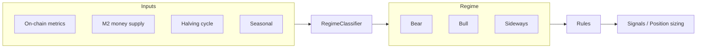
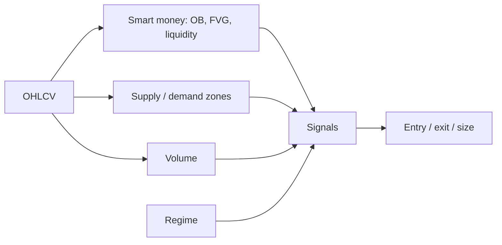

# Macro/Regime Trading Strategy Design

Strategy combines **timeline factors** (on-chain, M2, halving, seasonal) and **market regime** (bear, bull, sideways) to choose rules and position sizing.

## Architecture

## Timeline factors

1. **On-chain**
   - SOPR, MVRV, exchange reserves, active addresses, hash rate, funding (futures). Use for overbought/oversold and trend confirmation.
2. **M2 (global / US)**
   - YoY growth: e.g. > 2% expansion vs < 0% contraction. M2 expansion aligns with risk-on/bull; contraction with bear. Optional 90-day lag.
3. **BTC halving**
   - Pre-halving: accumulation (12–24 months), then run-up (3–9 months). Post-halving: discovery (6–24+ months). Use as regime context; macro can override.
4. **Seasonal**
   - Month/day-of-week or crypto calendar. Use as filters or position-size modifiers.

## Regime definitions

- **Bull:** Uptrend (e.g. higher highs/lows or MA stack), M2 expanding, on-chain not extreme (e.g. MVRV < 3.5).
- **Bear:** Downtrend, M2 contracting or < 0% YoY, on-chain capitulation (e.g. SOPR < 1, high exchange inflows).
- **Sideways:** Range, volatility contraction, M2 neutral or mixed.

## Strategy by regime

| Regime     | Goal                         | Example approach |
| ---------- | ---------------------------- | ----------------- |
| **Bear**   | Preserve capital, rare longs | Reduce size / no leverage; longs only on strong oversold (SOPR < 1, M2 turning positive). Shorts on bounces or avoid if policy shifting. |
| **Bull**   | Ride trend, avoid late FOMO  | Long bias; entries on pullbacks (MAs, support). Reduce/add targets when MVRV rich. Halving discovery = trend-follow. |
| **Sideways** | Mean reversion / range     | Fade extremes (support/resistance); tighter stops. Use seasonal/on-chain to avoid size in weak windows. |

## Timeline integration

- **Pre-halving (12–6 months before):** Favor accumulation; regime can still be bear/sideways → size accordingly.
- **Post-halving (6–24 months):** Often bull/sideways; combine M2 and on-chain to confirm trend and avoid late-cycle overexposure.
- **M2 < 0% or contracting:** Override halving “bull” narrative; reduce size, favor bear/sideways rules.
- **Seasonal:** Filter (e.g. reduce size in weak months) or small edge; not primary driver.

## Implementation order

See [IMPLEMENTATION_PLAN.md](IMPLEMENTATION_PLAN.md) for phased tasks. Summary: 1) Data (klines, M2, halving, on-chain), 2) Regime classifier + rule sets, 3) Technical (smart money, supply/demand, volume), 4) Signal fusion + sizing, 5) Backtest and execution.

---

# Technical Strategy: Smart Money, Supply/Demand, Volume

Technical layer adds **smart money concepts** (order blocks, fair value gaps, liquidity), **supply and demand zones**, and **volume** filters. These are combined with regime for entries and exits.

## Architecture (technical + regime)

## Smart money concepts

### 1. Order blocks (OB)

- **Definition:** The last opposite-colored candle (or small cluster) before a strong impulsive move. Treated as institutional entry zone.
- **Bullish OB:** Last down (or doji) candle before a sharp rally; zone = low to high of that candle.
- **Bearish OB:** Last up (or doji) candle before a sharp drop; zone = high to low of that candle.
- **Use:** Enter longs when price retests a bullish OB in an uptrend (regime bull/sideways); shorts at bearish OB in downtrend. Invalidate if zone is swept and price closes beyond.

### 2. Fair value gaps (FVG)

- **Bullish FVG:** Candle 1 high < Candle 3 low → gap (imbalance) between them. Price often returns to “fill” the gap; can act as support.
- **Bearish FVG:** Candle 1 low > Candle 3 high → gap; often resistance.
- **Use:** Entries when price revisits FVG and holds (e.g. bullish FVG in uptrend). Stop below/above the gap.

### 3. Liquidity (sweeps and levels)

- **Levels:** Swing highs (above market) and swing lows (below market). Stops often sit beyond these.
- **Sweep:** Price trades beyond the level (taking stops) then closes back inside range (reversal). “Stop hunt” / liquidity grab.
- **Use:** After a sweep of a swing low in an uptrend, look for long entries (OB/FVG/ demand). Stops placed beyond the swept level.

### 4. Break of structure (BOS) / change of character (CHoCH)

- **BOS:** Price breaks a prior swing high (bullish) or swing low (bearish), confirming trend continuation.
- **CHoCH:** First break against the prior trend (e.g. break of swing low in an uptrend) → possible trend change.
- **Use:** BOS to confirm trend; CHoCH to consider reversal or reduced exposure.

---

## Supply and demand zones

- **Demand (support):** Base/consolidation followed by a strong move up. Zone = range of the last candle(s) before the move (e.g. low–high of that candle).
- **Supply (resistance):** Base followed by a strong move down. Zone = range before the drop.
- **Strength:** Fresh zones (untested) preferred; volume on the breakout confirms. Multiple tests weaken the zone.
- **Use:** Longs at demand in bull/sideways; shorts at supply in bear/sideways. Align with regime and smart money (e.g. demand + bullish OB + volume confirmation).

---

## Volume

- **Volume average:** SMA of volume (e.g. 20-period). Compare current volume to average (above = high, below = low).
- **Climactic volume:** Spike (e.g. 2× average) often at exhaustion or capitulation; can mark reversals.
- **Volume confirmation:** Breakouts or OB/FVG entries with volume above average are weighted higher; low volume breakouts are filtered or sized down.
- **Use:** Require above-average volume on breakouts; optional filter for OB/zone entries. In regime logic, reduce size or skip entries when volume is very low (no conviction).

---

## How technical fits with regime

| Regime   | Smart money / zones use |
|----------|--------------------------|
| **Bull** | Longs at demand, bullish OB, or bullish FVG on pullbacks; avoid shorts; BOS confirms trend. |
| **Bear** | Shorts at supply, bearish OB, or bearish FVG on bounces; longs only at strong demand + sweep (e.g. liquidity grab). |
| **Sideways** | Both directions at supply/demand and OB/FVG; tighter stops; volume confirmation to avoid false breaks. |

---

## Implementation order (technical)

1. **Volume** – SMA, relative volume flag, optional climax detection.
2. **Swing points** – Detect swing highs/lows; then liquidity levels and sweep detection.
3. **Order blocks** – Last opposite candle before N-bar move (configurable strength).
4. **FVG** – 3-candle bullish/bearish FVG detection; store top/bottom of gap.
5. **Supply/demand** – Consolidation + expansion; zone from last candle before break.
6. **Fusion** – Combine with regime: entry only when regime allows direction and price is at a valid zone/OB/FVG; volume as filter.
