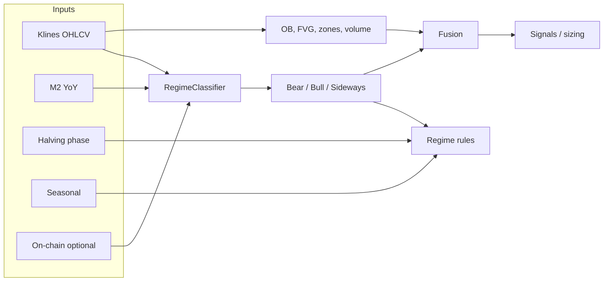

# Strategy Plan After Data Crawl

Data has been crawled (Binance spot + futures UM klines). This doc outlines how to **understand the data** and **plan the next steps** for the macro/regime + technical strategy.

---

## 1. Data status

- **Done:** Klines (ZIPs, optionally merged CSV) under `data/{spot|um}/klines/{symbol}/{interval}/`.
- **Schema:** See [DATA_UNDERSTANDING.md](DATA_UNDERSTANDING.md) for CSV columns (open_time, OHLCV, volume, etc.) and how they map to regime, technical, and fusion.
- **Coverage:** Symbols (e.g. BTCUSDT, ETHUSDT), intervals (e.g. 1h, 1d), date range from crawler args.

---

## 2. Strategy architecture (recap)

- **Regime:** Price (MA trend + volatility) + optional M2 + on-chain → bear / bull / sideways.
- **Rules:** Entry, exit, position size per regime; timeline (halving, seasonal) as filters.
- **Technical:** Order blocks, FVG, liquidity, supply/demand, volume (all from OHLCV).
- **Fusion:** Regime allows direction + price at zone/OB/FVG + volume confirmation → signal.

---

## 3. Implementation order (after data)

| Step | Task | Purpose |
|------|------|--------|
| **3.1** | **Kline loader** | Load from merged CSV or ZIPs → OHLCV arrays (+ open_time) for backtest and live. |
| **3.2** | **Regime on history** | Run classifier bar-by-bar (or rolling) on loaded klines; label each bar with regime for backtest. |
| **3.3** | **M2 + halving + seasonal** | Add data loaders (FRED M2, halving dates, seasonal flags); align by date to kline open_time. |
| **3.4** | **Wire M2/on-chain into regime** | Pass M2 YoY, SOPR, MVRV into `RegimeInputs` when available; use in filters. |
| **3.5** | **Backtest engine** | Walk forward on klines; compute regime, technical levels, fusion signal; apply regime rules (entry/exit/sizing); record PnL. |
| **3.6** | **Metrics + paper/live** | Sharpe, max DD, win rate, per-regime stats; then paper then live with same logic. |

Dependencies:

- 3.2 and 3.5 depend on 3.1.
- 3.4 and 3.5 benefit from 3.3 (timeline + M2).
- Technical layer (OB, FVG, zones, volume) already consumes OHLCV; no extra data beyond klines.

---

## 4. What to build next (concrete)

1. **Data loaders**
   - **Klines:** Function(s) that take `(data_dir, market_type, symbol, interval)` and return sorted `open_time`, `open`, `high`, `low`, `close`, `volume` (and optionally quote_volume, num_trades). Prefer merged CSV if present; else read and merge from ZIPs in the interval folder.
   - **M2:** FRED series (or CSV) by date; align to kline dates (e.g. daily close or last-known M2 per bar).
   - **Halving / seasonal:** `strategy.timeline` already has halving dates and seasonal; align to bar date from `open_time`.

2. **Regime on full history**
   - For each bar (or rolling window), build `RegimeInputs(close, high, low, m2_yoy?, sopr?, mvrv?)` and call `RegimeClassifier.classify()`.
   - Store regime label per bar for backtest (and optional analysis/plots).

3. **Backtest**
   - Iterate bars in time order; at each bar: regime, OB/FVG/zones, volume state, fusion signal.
   - Apply regime rule set: entry/exit/sizing; optional timeline filters (e.g. reduce size in weak seasonal or when MVRV &gt; 3.5).
   - Simulate positions, PnL, drawdown; output metrics.

4. **Optional**
   - On-chain loader (SOPR, MVRV) and wire into regime + filters.
   - Position sizing with ATR/volatility scaling.

---

## 5. References

- **Data details:** [DATA_UNDERSTANDING.md](DATA_UNDERSTANDING.md)
- **Strategy design:** [STRATEGY.md](STRATEGY.md) (macro + technical)
- **Phased plan:** [IMPLEMENTATION_PLAN.md](IMPLEMENTATION_PLAN.md) (Phases 1–5)
- **Original plan:** Binance data crawl + macro/regime strategy plan (Part 1 & 2)
